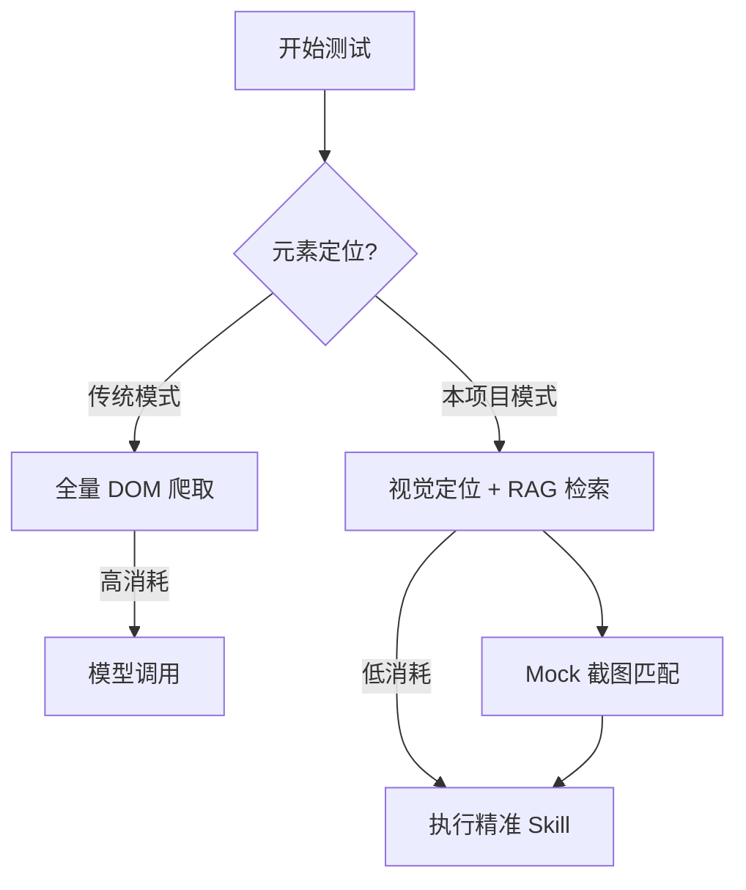

# 🚀 Test with AI

  <b>内置 OpenClaw 的智能自动化测试助手，专注解决 Token 消耗痛点</b>

  
  
  
  

---

## 🌟 项目初衷

在 OpenClaw 面世以来，接入测试环境时最显著的痛点就是 **Token 消耗爆炸**。每次简单的页面操作都可能伴随着全量 DOM 的重新爬取和模型调用。

**Test with AI** 旨在通过 **RAG 检索增强**、**视觉定位优化** 以及 **多模型调度策略**，在保证自动化测试强度的同时，将 Token 成本降至最低。

---

## ✨ 核心特性

| 特性 | 说明 |
| :--- | :--- |
| 📦 **本地部署** | 支持拖拽包、上传网站，在本地环境快速开启自动化测试。 |
| 🛠️ **Skill & MCP** | 内置多种 Skill，支持自定义 MCP Server 集成，打通平台生态。 |
| 🧠 **RAG 驱动** | 通过需求文档、测试用例和 Mock 截图构建本地知识库，大幅减少上下文消耗。 |
| 📱 **多端支持** | 已支持 Web、Android 测试，iOS 开发计划已在路上。 |
| 💰 **降本方案** | 自定义模型 Endpoint (BaseUrl/ModelID)，支持 DeepSeek、Qwen 等高性价比模型。 |
| 🔗 **生态闭环** | 深度集成腾讯 Tapd，测试完成后可直接一键提交缺陷。 |

---

## 🏗️ 核心逻辑：如何节省 Token？

项目摒弃了 OpenClaw 传统的“全量爬取”模式，采用以下策略：

1.  **视觉定位代替代码定位**：首次启动进行全量 Mock 截图。后续通过视觉特征匹配元素，避免反复拉取数万行的 HTML 代码。
2.  **RAG 知识注入**：将冗长的需求文档和用例库向量化。模型执行时仅调取最相关的片段，而非全量输入。
3.  **调用策略优化**：改写测试 Skill 逻辑，优先使用 Playwright 等脚本引擎执行原子操作。

---

## 🚀 快速开始

### 一键部署运行

只需一行命令，即可在本地自动配置环境并启动项目：

（开发中）

---

## 🛠️ 原生集成

### 🧰 内置 Skills
- `browser_use`: 优化的元素操作与视觉定位。
- `skill_use`: Skill 调度与执行引擎。
- `tapd_skill`: 腾讯 Tapd 平台缺陷管理。
- `find_skill`: 智能 Skill 检索。

### 🔌 MCP Server
支持标准 Model Context Protocol (MCP)，您可以轻松接入外部工具链或自定义业务逻辑。

---

## 🗺️ 路线图 (Roadmap)

- [x] 核心 RAG 逻辑框架搭建
- [x] Web & Android 端自动化驱动
- [ ] 优化视觉定位算法，进一步提升稳定性
- [ ] 增加更多高频测试场景 (安全、性能)
- [ ] iOS 端全量适配支持
- [ ] 集成 CI/CD 流程，实现回归测试闭环
- [ ] 生产环境全自动验收方案

---

## 🤝 贡献与反馈

欢迎提交 Issue 或 Pull Request！我们致力于让 AI 自动化测试变得更便宜、更高效。

**License:** [MIT](LICENSE)
