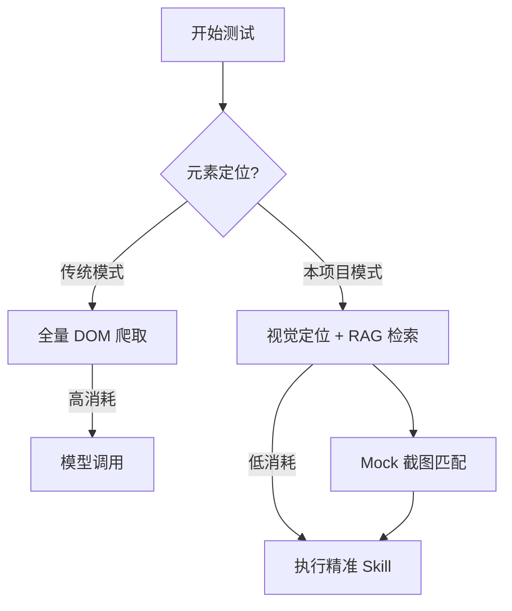

# 🚀 Test with AI

<p align="center">
  <b>基于Copaw深度定制，内置 OpenClaw 的智能自动化测试助手，优化OpenClaw测试流程，减少Token消耗，提高测试效率。</b>
</p>

<p align="center">
  
  
  
  
</p>

---

## 🌟 项目初衷

在 OpenClaw 面世以来，接入测试环境时最显著的痛点就是 **Token 消耗爆炸**。每次简单的页面操作都可能伴随着全量 DOM 的重新爬取和模型调用。

**Test with AI** 是基于 [CoPaw](https://github.com/agentscope-ai/CoPaw) 深度定制的自动化测试版本。旨在通过 **RAG 检索增强**、**视觉定位优化** 以及 **多模型调度策略**，在保证自动化测试强度的同时，将 Token 成本降至最低。

---

## ✨ 核心特性

| 特性 | 说明 |
| :--- | :--- |
| 📦 **一键部署** | 支持 `curl | bash` 或 `irm | iex` 一键完成环境配置与安装。 |
| 🛠️ **Skill & MCP** | 继承 CoPaw 强大的插件系统，内置多种测试专属 Skill。 |
| 🧠 **RAG 驱动** | 通过需求文档、测试用例和 Mock 截图构建本地知识库，大幅减少上下文消耗。 |
| 📱 **多端支持** | 已支持 Web、Android 测试，iOS 开发计划已在路上。 |
| 💰 **降本方案** | 支持自定义模型 Endpoint，适配 DeepSeek、Qwen 等高性价比模型。 |
| 🔗 **生态闭环** | 深度集成腾讯 Tapd，测试完成后可直接一键提交缺陷。 |

---

## 🚀 快速开始

### 1. 一键安装与配置

本项目提供高度自动化的脚本，会自动处理 `uv` 包管理器、Python 虚拟环境及依赖。

**Linux / macOS / WSL:**
```bash
bash scripts/install.sh
```

**Windows (PowerShell):**
```powershell
powershell -ExecutionPolicy ByPass -File scripts/install.ps1
```

---

### 2. 运行项目 (零配置模式)

安装完成后，您可以直接在项目根目录下使用快捷启动脚本，**无需配置任何系统环境变量**：

**Windows:**
```cmd
.\twai.bat init --defaults
.\twai.bat app
```

**Linux / macOS:**
```bash
./twai.sh init --defaults
./twai.sh app
```

> **提示**：启动 `twai app` 后，在浏览器打开 `http://127.0.0.1:8088` 即可进入控制台。

---

## 🏗️ 核心逻辑：如何节省 Token？



1.  **视觉定位代替代码定位**：通过视觉特征匹配元素，避免反复拉取数万行的 HTML 代码。
2.  **RAG 知识注入**：模型执行时仅调取最相关的需求片段，而非全量输入。
3.  **调用策略优化**：改写测试 Skill 逻辑，优先使用 Playwright 等脚本引擎执行原子操作。

---

## 🛠️ 命令行工具 (CLI)

安装后，您可以使用 `twai` 命令管理项目：

- `twai init`: 初始化配置（交互式）。
- `twai app`: 启动 Web 控制台 (默认 http://127.0.0.1:8088)。
- `twai skills`: 管理和查看已安装的测试技能。
- `twai env`: 配置环境变量（如 API Keys）。

---

## 🤝 贡献与反馈

欢迎提交 Issue 或 Pull Request！我们致力于让 AI 自动化测试变得更便宜、更高效。

**License:** [Apache License 2.0](LICENSE)
